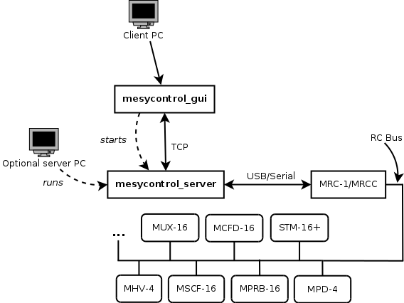
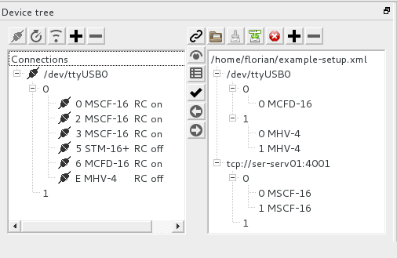
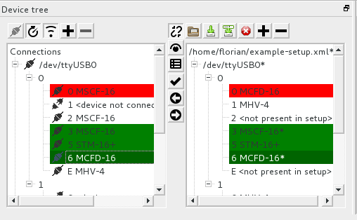

.. mesycontrol documentation master file, created by
   sphinx-quickstart on Mon Sep 15 09:48:17 2014.
   You can adapt this file completely to your liking, but it should at least
   contain the root `toctree` directive.

.. toctree::

*mesycontrol* documentation
===========================

.. * TODO: Table View
.. * TODO: Specialized GUIs
.. * TODO:
..   * how it works with multiple clients (write access)
..   * silent mode
..   * polling, how it works
..   * scanbus polling
..   * configs, extensions, applying and comparing hardware and setup

Introduction
------------
*mesycontrol* is a remote control solution for detector readout systems by
mesytec. *mesycontrol* makes use of the mesytec RC bus controllers (MRC-1/MRCC)
to communicate with the actual devices. For user interaction a GUI application
is provided.

Features
^^^^^^^^
* MRC-1/MRCC connectivity via USB, serial port and network.
* Client-server architecture using plain TCP as the transport. This enables the
  graphical frontend to run and operate on machines without direct access to
  the mesytec hardware.
* Storing and loading of single device configurations and complete setups
  (multiple devices and multiple MRCs).
* Tabular view/editing of device memory.
* Custom GUIs for MHV-4, MSCF-16, STM-16+ and MCFD-16.
* Polling of frequently changing parameters (e.g. voltage or current)
* Cross-platform: both client and server run on Linux and Windows
* Offline editing: device configurations can be created/edited without access
  to the hardware.

Installation
------------
Linux installation
^^^^^^^^^^^^^^^^^^
*mesycontrol* requires the Qt libraries >= 4.8 to be installed on your system.
Also be sure to pick the right archive for your distribution and architecture
as trying to run the 32 bit version of the software on a 64 bit linux
installation will most likely result in errors about missing libraries. 

The installation itself is simple: unpack the tar.bz2 archive and execute the
*mesycontrol_gui* binary to get started::

  $ tar xf mesycontrol-1.0.tar.bz2
  $ ./mesycontrol-1.0/bin/mesycontrol_gui

.. note::

  So far *mesycontrol* has only been tested on Debian Wheezy, Ubuntu 12.04
  and OpenSUSE 12.1 but it should work on other distributions and versions as
  long as the C++ and Qt libraries stay binary compatible.

Linux USB and serial port permissions
^^^^^^^^^^^^^^^^^^^^^^^^^^^^^^^^^^^^^
In order to access local USB and serial ports the user running mesycontrol
needs write access to the corresponding device files. The device files for USB
ports are /dev/ttyUSB0, /dev/ttyUSB1, etc. - serial ports are usually named
/dev/ttyS0, /dev/ttyS1, etc.

These device files are usually group writeable and owned by the *dialout* group.

The following contains example shell commands for various Linux distributions
to add a user to the dialout group.

Debian, Ubuntu and derivatives
""""""""""""""""""""""""""""""
::

  $ sudo adduser the_user dialout

OpenSUSE, Fedora
""""""""""""""""
::

  $ sudo usermod -a -G dialout the_user

.. note::

  For the group membership changes to take effect a re-login is required.

Windows
^^^^^^^
*mesycontrol* does not require any additional dependencies on Windows. Simply
run the supplied installer and start the program via the start menu link. If
you prefer not running an installer download the zipped version of the package
instead, unpack the archive and run the file *bin\\mesycontrol_gui.exe*.

Architecture Overview
---------------------

   mesycontrol architecture

*mesycontrol* is divided into two parts: *mesycontrol_server* handling MRC
connectivity and communication, and the client part (*mesycontrol_gui*)
connecting to running server processes via TCP.

The GUI client will transparently spawn its own server process if the user
requests a local MRC connection via serial port or USB.

In case the client PC does not have a direct connection to an MRC-1/MRCC the
server can be run stand-alone on a machine with direct access to the hardware.
The GUI client then connects via a TCP connection to the remotely running
server process.

The client supports connections to multiple servers and is thus able to control
multiple MRC-1/MRCCs.

.. raw:: latex

  \newpage

Using mesycontrol
-----------------
Terms and Concepts
^^^^^^^^^^^^^^^^^^

* MRC

  A MRC-1 or MRCC mesytec RC bus master. In the GUI each MRC is uniquely
  identified by its connection URL.

  The are three ways to connect to a MRC:

  * Serial connection: uses a local serial or USB port.
  * TCP connection: uses a remote serial server which is connected to the MRC.
  * Mesycontrol connection: connects to a (remotely) running *mesycontrol_server* instance.

  See :ref:`mrc-url-format` for details.

* Device

  A mesytec device with support for the mesytec remote control bus. A device is
  identified by its parent MRC, its bus number and its address on the bus. The
  device type is determined by the devices ID code.

* Setup

  A tree of MRC configurations and their child device configs.
  Can be loaded from and saved to file.

.. Add a manual page break to latex output.
.. raw:: latex

  \newpage

GUI overview
^^^^^^^^^^^^

   Device tree with **linked_mode** disabled.

The GUI shows hardware and config trees side-by-side. On the left-hand side
active MRC connections and their connected devices are shown. On the right-hand
side the currently opened setup with its MRC and device configurations is
displayed.

At startup the two sides will not be linked together. This means hardware and
setup can be separately edited without affecting each other.

Using the *link mode* button in the center of the tree view **linked-mode** can
be activated. In this mode the hardware and setup trees are compared against
each other, differences and conflicts are highlighted and devices missing on
either side are also shown. In linked-mode it is possible to have changes to
device parameters apply to both the hardware and the config side keeping both
trees in sync.

   Device tree with **linked_mode** enabled. The red row highlights an IDC
   conflict. Green rows mean that hardware and config are equal.

.. raw:: latex

  \newpage

Devices with a red background have conflicting device types (their IDCs do not
match). A green background means hardware and config parameters are equal.
Orange indicates that hardware and config states differ. No special color means
that the state is not yet known (hardware values have not been read yet).

Using the arrow buttons on the center bar device state can be copied from
hardware to config and vice-versa. This works for single devices aswell as for
parts of the tree (e.g. apply all device configs of the selected MRC to the
hardware).

Pressing the checkmark icon will (re)read needed parameters from the hardware
and compare them against the configuration.

The two buttons just below the link mode button will open a specialized device
GUI (if one is available) and a tabular view of the devices parameters
respectively.

Device GUIs
^^^^^^^^^^^
Currently there are two types of device GUIs: the device table view which works
for all devices (even devices unknown to the application) and specialized
device GUIs for known devices.

All device GUIs support different display and write modes. In case of the
device table view the following display modes are available: `hardware`,
`config` and `combined` with `combined` displaying both the hardware and the
config columns. The same options are available for the write mode with
`combined` mode writing to the device config first, then to the device
hardware.

Specialized device widgets currently do not support `combined` display mode but
one of `hardware` or `config`. Write mode works the same as for device table
views.

The side of the device tree that is selected, the availability of
hardware/config and the state of **linked_mode** determine the display and
write modes for newly opened device windows. Using two buttons at the top
toolbar both modes can be changed after window creation.

  
   Display and write mode icons.

The modes currently in effect are also displayed in the device windows title
bar.

.. raw:: latex

  \newpage

Stand-alone server operation
----------------------------
* Binary location:

  * Linux: bin/mesycontrol_server
  * Windows: mesycontrol_server.exe in the installation path

* Handles all MRC communication
* Opens a listening socket and waits for mesycontrol clients to connect
* Common use cases:

  * Using a local serial port and listening on all network interfaces:::

      $ ./mesycontrol_server --mrc-serial-port=/dev/ttyUSB0

  * Local serial port as above but limit the listening socket to a certain IP
    address and using a different listening port:::

      $ ./mesycontrol_server --mrc-serial-port=/dev/ttyUSB0 \
        --listen-address=192.168.168.202 --listen-port=23023

  * Connection to a serial server:::

      $ ./mesycontrol_server --mrc-host=example.com --mrc-port=42000

* To stop a running server instance hit *CTRL-C* in the terminal or send the
  termination signal to the process (e.g. via the *kill* command)

* An overview of all options is available by running::

  $ ./mesycontrol_server --help

.. raw:: latex

  \newpage

XML format
----------
Mesycontrol stores device configurations and setups in XML files. The root
element required for all XML files is **mesycontrol** with one optional
attribute called **version** specifying the config file version (defaults to
1).

Device config
^^^^^^^^^^^^^
A device config starts with the **device_config** element. The following
sub-elements contain information about the device:

* idc

  The **idc** element specifies the devices identifier code, e.g. 27 for a MHV-4.

* bus

  The devices bus number.

* address

  The devices address on the bus.

* name

  Optional user-defined name for the device. Defaults to an empty string.

* parameter

  Repeated element containing device parameter addresses and values. The
  **parameter** element requires two attributes: **address** specifying the
  parameters address (range [0, 255]) and **value** containing its value (range
  [0,65535]).

* extension

  May appear multiple times. Stores additional information about a device (e.g.
  jumper values that can not be read from the hardware). The required attribute
  **name** contains the extensions unique name. The extension data is contained
  in a **value** sub-element. The value type is set using the **type**
  attribute. Currently the following types are supported: *str*, *int*,
  *float*, *list*, *dict*.
  
  The list and dictionary types may be nested. Lists contain **value**
  subelements, dictionaries contain **key** elements with one mandatory
  attribute called **name** holding the keys name as a string and a
  **value** subelement defining the keys value.

MRC config
^^^^^^^^^^
The top-level element of a MRC configuration is named **mrc_config**. Possible
sub-elements are:

* url

  Required element containing details about how to connect to the MRC.

  Example: *serial:///dev/ttyUSB0* will connect via a local serial device using
  baud rate auto-detection.

  See :ref:`mrc-url-format` for details.

* name

  Optional user-defined name for the MRC.

* device_config

  Repeated element containing child device configurations.

Setup
^^^^^
The top-level element of a setup is called **setup**. Currently the only valid
sub-elements for a **setup** node are **mrc_config** elements.

.. _mrc-url-format:

MRC URL format
^^^^^^^^^^^^^^
The URLs used in MRC configs follow standard URL schemes:
*<proto>://<location>[<options>]*. Currently the following protocols are
supported:

* **serial**

  MRC connectivity using a local serial port. If no baud-rate is specified
  auto-detection will be attempted.

  Format:
    - *serial://<path-to-device>[@baud-rate]*

  Examples:
    - *serial:///dev/ttyUSB0@115200*
    - *serial:///dev/ttyS0* 
    - *serial://COM4*

* **tcp**

  Connecting via a serial server (e.g. a Moxa NPort device or the unix program
  *ser2net*).

  **Note**: Port defaults to 4001.

  Format:
    - *tcp://<hostname>[:port]*

  Example:
    - *tcp://serial-server.example.com:4002*

* **mc**

  Direct connection to a mesycontrol server process.

  **Note**: Port defaults to 23000 (the servers default listening port).

  Format:
    - *mc://<hostname>[:port]*

  Example:
    - *mc://mc-server.example.com:23003*

XML Examples
^^^^^^^^^^^^
Sample MSCF-16 config
"""""""""""""""""""""

::

  <?xml version="1.0" ?>
  <mesycontrol version="1">
    <device_config>
      <idc>20</idc>
      <bus>1</bus>
      <address>3</address>
      <name/>
      <!--gain_group0-->
      <parameter address="0" value="12"/>
      <!--gain_group1-->
      <parameter address="1" value="12"/>
      <!--gain_group2-->
      <parameter address="2" value="12"/>
      <!--gain_group3-->
      <parameter address="3" value="12"/>
      ...
      <extension name="cfd_delay">
        <value type="int">30</value>
      </extension>
      <extension name="input_connector">
        <value type="str">L</value>
      </extension>
      <extension name="gain_adjusts">
        <value type="list">
          <value type="int">1</value>
          <value type="int">1</value>
          <value type="int">1</value>
          <value type="int">1</value>
        </value>
      </extension>
      ...
    </device_config>
  </mesycontrol>

Sample setup
""""""""""""

::

  <?xml version="1.0" ?>
  <mesycontrol version="1">
    <setup>
      <mrc_config>
        <url>serial:///dev/ttyUSB0</url>
        <name/>
        <device_config>
          <idc>20</idc>
          <bus>0</bus>
          <address>0</address>
          <name/>
          <!--gain_group0-->
          <parameter address="0" value="12"/>
          <!--gain_group1-->
          <parameter address="1" value="12"/>
          ...
        </device_config>
        ...
      </mrc_config>
      <mrc_config>
        <url>tcp://localhost:4002</url>
        <device_config>
        ...
        </device_config>
        ...
      </mrc_config>
      ...
    </setup>

.. TODOS
.. =====
.. .. todolist::

.. Indices and tables
.. ==================
.. 
.. * :ref:`genindex`
.. * :ref:`modindex`
.. * :ref:`search`

